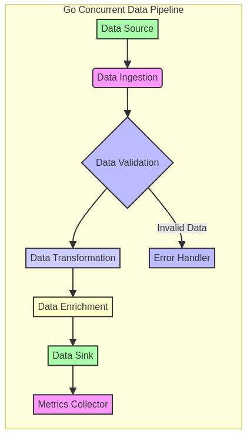

# Concurrent Data Pipeline with Go

[](https://goreportcard.com/report/github.com/GabrielDemetriosLafis/go-concurrent-data-pipeline)


---

## 🇧🇷 Pipeline de Dados Concorrente com Go

Este repositório apresenta uma **pipeline de dados de alta performance e concorrência desenvolvida em Go**, projetada para processar grandes volumes de dados de forma eficiente e escalável. O foco é em demonstrar como utilizar as capacidades de concorrência nativas do Go (goroutines e channels) para construir sistemas de processamento de dados robustos, tolerantes a falhas e com baixa latência. É ideal para **engenheiros de dados, desenvolvedores de backend e arquitetos de sistemas** que buscam soluções eficientes para ingestão, transformação e carregamento de dados em tempo real ou em lote.

### 🎯 Objetivo

O principal objetivo deste projeto é **fornecer exemplos práticos, código funcional e documentação detalhada** sobre a construção de pipelines de dados concorrentes com Go. Serão abordados tópicos como consumo de mensagens de filas (e.g., Kafka), processamento paralelo de dados, persistência em bancos de dados, tratamento de erros e monitoramento, tudo com foco em **performance, resiliência e manutenibilidade**, com ênfase em **validação de dados, transformações complexas, tratamento de erros e coleta de métricas**.

### ✨ Destaques

- **Concorrência Nativa com Go**: Utilização de goroutines e channels para construir pipelines de dados altamente concorrentes e eficientes, permitindo o processamento paralelo de dados em várias etapas.
- **Validação de Dados e Tratamento de Erros**: Implementação de uma etapa de validação (`validator`) que filtra dados inválidos e um `errorHandler` dedicado para persistir e gerenciar registros com falha, garantindo a integridade da pipeline.
- **Transformações de Dados Complexas**: A etapa de `transformer` demonstra como aplicar lógica de negócios mais sofisticada, como cálculo de scores de anomalia, e lidar com diferentes tipos de erros de transformação.
- **Coleta e Sumarização de Métricas**: Um `metricsCollector` dedicado para monitorar o fluxo de dados, contando registros processados, erros e anomalias, fornecendo um sumário abrangente da performance da pipeline.
- **Persistência Flexível**: Os `loader` e `errorHandler` persistem os dados processados e com erro em arquivos JSONL, demonstrando uma abordagem flexível para armazenamento de resultados.
- **Escalabilidade Horizontal**: O design da pipeline permite fácil escalabilidade, adicionando mais workers para as etapas de validação e transformação conforme a demanda.
- **Código Profissional**: Exemplos de código bem estruturados, seguindo as melhores práticas da indústria, com foco em clareza, eficiência e documentação interna.
- **Testes Incluídos**: Módulos de código validados através de testes unitários e de integração, garantindo a robustez e a confiabilidade das implementações.

### 🚀 Benefícios do Go para Pipelines de Dados em Ação

Go é uma linguagem poderosa e eficiente para a construção de pipelines de dados concorrentes e de alta performance. Este projeto ilustra como esses benefícios são explorados:

1.  **Concorrência Simplificada e Eficaz:** Com goroutines e channels, Go torna a programação concorrente muito mais fácil e segura, permitindo a construção de um pipeline multi-estágio (producer, validator, transformer, loader, errorHandler, metricsCollector) onde cada etapa opera de forma independente e paralela.

2.  **Performance Otimizada:** Compilado para código de máquina, Go oferece performance próxima à de C/C++, ideal para cargas de trabalho intensivas em CPU e I/O, como a geração, validação e transformação de milhões de registros de dados.

3.  **Eficiência de Recursos:** Goroutines são leves e o scheduler do Go é otimizado para gerenciar milhares delas eficientemente, resultando em baixo consumo de memória e CPU, mesmo ao lidar com um grande número de registros e workers.

4.  **Tratamento de Erros Robusto:** O modelo de tratamento de erros explícito de Go é fundamental para pipelines de dados, permitindo que a pipeline identifique e desvie registros inválidos ou com falha para um `errorHandler` dedicado, sem interromper o fluxo principal.

5.  **Observabilidade Integrada:** A inclusão de um `metricsCollector` demonstra como é fácil integrar a coleta de métricas diretamente na pipeline, fornecendo insights em tempo real sobre o volume de dados, erros e anomalias.

6.  **Modularidade e Manutenibilidade:** A estrutura baseada em funções e canais promove a modularidade, tornando cada etapa da pipeline um componente independente que pode ser facilmente testado, mantido e substituído.

---

## 🇬🇧 Concurrent Data Pipeline with Go

This repository presents a **high-performance and concurrent data pipeline developed in Go**, designed to process large volumes of data efficiently and scalably. The focus is on demonstrating how to use Go's native concurrency capabilities (goroutines and channels) to build robust, fault-tolerant, and low-latency data processing systems. It is ideal for **data engineers, backend developers, and system architects** seeking efficient solutions for real-time or batch data ingestion, transformation, and loading.

### 🎯 Objective

The main objective of this project is to **provide practical examples, functional code, and detailed documentation** on building concurrent data pipelines with Go. Topics covered include consuming messages from queues (e.g., Kafka), parallel data processing, persistence in databases, error handling, and monitoring, all with a focus on **performance, resilience, and maintainability**, with an emphasis on **data validation, complex transformations, error handling, and metrics collection**.

### ✨ Highlights

- **Native Concurrency with Go**: Utilization of goroutines and channels to build highly concurrent and efficient data pipelines, allowing parallel data processing at various stages.
- **Data Validation and Error Handling**: Implementation of a validation stage (`validator`) that filters invalid data and a dedicated `errorHandler` to persist and manage failed records, ensuring pipeline integrity.
- **Complex Data Transformations**: The `transformer` stage demonstrates how to apply more sophisticated business logic, such as anomaly score calculation, and handle different types of transformation errors.
- **Metrics Collection and Summarization**: A dedicated `metricsCollector` to monitor data flow, counting processed records, errors, and anomalies, providing a comprehensive summary of pipeline performance.
- **Flexible Persistence**: The `loader` and `errorHandler` persist processed and erroneous data into JSONL files, demonstrating a flexible approach to result storage.
- **Horizontal Scalability**: The pipeline design allows for easy scalability, adding more workers for validation and transformation stages as demand increases.
- **Professional Code**: Well-structured code examples, following industry best practices, with a focus on clarity, efficiency, and internal documentation.
- **Tests Included**: Code modules validated through unit and integration tests, ensuring the robustness and reliability of the implementations.

### 📊 Visualization



*Diagrama ilustrativo da arquitetura da pipeline de dados concorrente em Go, destacando as etapas de processamento e a comunicação entre elas.*


---

## 🛠️ Tecnologias Utilizadas / Technologies Used

| Categoria         | Tecnologia      | Descrição                                                                 |
| :---------------- | :-------------- | :------------------------------------------------------------------------ |
| **Linguagem**     | Go              | Linguagem principal para desenvolvimento da pipeline de dados concorrente. |
| **Concorrência**  | Goroutines, Channels | Primitivas nativas do Go para programação concorrente e comunicação segura. |
| **Formato de Dados** | JSONL           | Formato de arquivo para armazenamento de dados processados e com erro.    |
| **Testes**        | `testing`       | Pacote padrão do Go para escrita de testes unitários e de integração.     |
| **Logging**       | `log`           | Pacote padrão do Go para registro de eventos e mensagens da pipeline.     |
| **Diagramação**   | Mermaid         | Para criação de diagramas de arquitetura e fluxo de dados no README.      |

---

## 📁 Repository Structure

```
go-concurrent-data-pipeline/
├── src/           # Contém o arquivo main.go, o ponto de entrada da aplicação.
├── pkg/pipeline/  # Módulo Go contendo as implementações das etapas da pipeline (producer, validator, transformer, loader, errorHandler, metricsCollector).
├── config/        # Arquivos de configuração (a ser expandido)
├── data/          # Dados de exemplo para testes e simulações (a ser expandido)
├── images/        # Imagens e diagramas para o README e documentação
├── tests/         # Testes unitários e de integração para os componentes da pipeline
├── docs/          # Documentação adicional, tutoriais e guias de arquitetura
├── logs/          # Diretório para logs de execução da pipeline
└── README.md      # Este arquivo
```

---

## 🚀 Getting Started

Para começar, clone o repositório e explore os diretórios `src/` e `pkg/pipeline/` para exemplos detalhados e instruções de uso. Certifique-se de ter o Go instalado em sua máquina.

### Pré-requisitos

- Go (versão 1.18+ recomendada)

### Instalação

```bash
git clone https://github.com/GabrielDemetriosLafis/go-concurrent-data-pipeline.git
cd go-concurrent-data-pipeline

# Não há dependências externas além do Go padrão para este projeto.
# Para rodar os testes:
go test ./...
```

### Exemplo de Uso Avançado (Go)

O exemplo abaixo demonstra a execução da pipeline de dados concorrente, utilizando o módulo `pkg/pipeline` para orquestrar as etapas de geração de registros, validação, transformação (com detecção de anomalias), carregamento para arquivos de saída e tratamento de erros. Um `metricsCollector` sumariza o desempenho da pipeline, fornecendo uma visão completa do fluxo de dados.

```go
package main

import (
	"fmt"
	"log"
	"os"
	"go-concurrent-data-pipeline/pkg/pipeline"
)

func main() {
	log.SetFlags(log.Ldate | log.Ltime | log.Lshortfile)
	fmt.Println("===========================================")
	fmt.Println("Go Concurrent Data Pipeline")
	fmt.Println("===========================================")

	// Limpar arquivos de saída anteriores
	_ = os.Remove("processed_data.jsonl")
	_ = os.Remove("failed_data.jsonl")

	// Executar a pipeline com 50 registros e 3 workers para validação/transformação
	// Os logs detalhados serão exibidos no console e as métricas no final.
	pipeline.RunAdvancedPipeline(50, 3)

	fmt.Println("===========================================")
	fmt.Println("Pipeline completed!")
	fmt.Println("===========================================")

	// Opcional: Ler os arquivos de saída para verificar o conteúdo
	fmt.Println("\nConteúdo de processed_data.jsonl:")
	processedContent, err := os.ReadFile("processed_data.jsonl")
	if err == nil {
		fmt.Println(string(processedContent))
	} else {
		fmt.Println("  (Arquivo não encontrado ou vazio)")
	}

	fmt.Println("\nConteúdo de failed_data.jsonl:")
	failedContent, err := os.ReadFile("failed_data.jsonl")
	if err == nil {
		fmt.Println(string(failedContent))
	} else {
		fmt.Println("  (Arquivo não encontrado ou vazio)")
	}
}
```

---

## 🤝 Contribuição

Contribuições são bem-vindas! Sinta-se à vontade para abrir issues, enviar pull requests ou sugerir melhorias. Por favor, siga as diretrizes de contribuição.

---

## 📝 Licença

Este projeto está licenciado sob a Licença MIT - veja o arquivo [LICENSE](LICENSE) para detalhes.

---

**Autor:** Gabriel Demetrios Lafis  \n**Ano:** 2025

