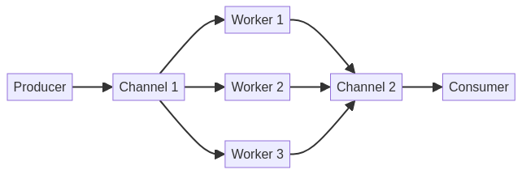

# Concurrent Data Pipeline with Go


Este projeto pode ser visualizado e interagido através do GitHub Pages: [https://gabrieldemetrioslafis.github.io/go-concurrent-data-pipeline/](https://gabrieldemetrioslafis.github.io/go-concurrent-data-pipeline/)

This project can be viewed and interacted with via GitHub Pages: [https://gabrieldemetrioslafis.github.io/go-concurrent-data-pipeline/](https://gabrieldemetrioslafis.github.io/go-concurrent-data-pipeline/)

---

## 🇧🇷 Pipeline de Dados Concorrente com Go

Este repositório apresenta uma **pipeline de dados de alta performance e concorrência desenvolvida em Go**, projetada para processar grandes volumes de dados de forma eficiente e escalável. O foco é em demonstrar como utilizar as capacidades de concorrência nativas do Go (goroutines e channels) para construir sistemas de processamento de dados robustos, tolerantes a falhas e com baixa latência. É ideal para **engenheiros de dados, desenvolvedores de backend e arquitetos de sistemas** que buscam soluções eficientes para ingestão, transformação e carregamento de dados em tempo real ou em lote.

### 🎯 Objetivo

O principal objetivo deste projeto é **fornecer exemplos práticos, código funcional e documentação detalhada** sobre a construção de pipelines de dados concorrentes com Go. Serão abordados tópicos como consumo de mensagens de filas (e.g., Kafka), processamento paralelo de dados, persistência em bancos de dados, tratamento de erros e monitoramento, tudo com foco em **performance, resiliência e manutenibilidade**.

### ✨ Destaques

- **Concorrência Nativa com Go**: Utilização de goroutines e channels para construir pipelines de dados altamente concorrentes e eficientes.
- **Processamento de Streams**: Exemplos de como processar dados em tempo real a partir de fontes como Apache Kafka.
- **Tolerância a Falhas**: Estratégias para lidar com erros e garantir a resiliência da pipeline, incluindo retries e dead-letter queues.
- **Escalabilidade Horizontal**: Design da pipeline para fácil escalabilidade, permitindo adicionar mais workers conforme a demanda.
- **Código Profissional**: Exemplos de código bem estruturados, seguindo as melhores práticas da indústria, com foco em clareza, eficiência e documentação interna.
- **Documentação Completa**: Cada componente da pipeline é acompanhado de documentação detalhada, diagramas explicativos e casos de uso práticos.
- **Testes Incluídos**: Módulos de código validados através de testes unitários e de integração, garantindo a robustez e a confiabilidade das implementações.
- **Abordagem Didática**: Conteúdo apresentado de forma didática, ideal para aprendizado e referência, com explicações claras sobre os conceitos e a aplicação prática.


## 🇬🇧 Concurrent Data Pipeline with Go

This repository presents a **high-performance and concurrent data pipeline developed in Go**, designed to process large volumes of data efficiently and scalably. The focus is on demonstrating how to use Go's native concurrency capabilities (goroutines and channels) to build robust, fault-tolerant, and low-latency data processing systems. It is ideal for **data engineers, backend developers, and system architects** seeking efficient solutions for real-time or batch data ingestion, transformation, and loading.

### 🎯 Objective

The main objective of this project is to **provide practical examples, functional code, and detailed documentation** on building concurrent data pipelines with Go. Topics covered include consuming messages from queues (e.g., Kafka), parallel data processing, persistence in databases, error handling, and monitoring, all with a focus on **performance, resilience, and maintainability**.

### ✨ Highlights

- **Native Concurrency with Go**: Utilization of goroutines and channels to build highly concurrent and efficient data pipelines.
- **Stream Processing**: Examples of how to process real-time data from sources like Apache Kafka.
- **Fault Tolerance**: Strategies for handling errors and ensuring pipeline resilience, including retries and dead-letter queues.
- **Horizontal Scalability**: Pipeline design for easy scalability, allowing more workers to be added as demand increases.
- **Professional Code**: Well-structured code examples, following industry best practices, with a focus on clarity, efficiency, and internal documentation.
- **Complete Documentation**: Each pipeline component is accompanied by detailed documentation, explanatory diagrams, and practical use cases.
- **Tests Included**: Code modules validated through unit and integration tests, ensuring the robustness and reliability of the implementations.
- **Didactic Approach**: Content presented didactically, ideal for learning and reference, with clear explanations of concepts and practical application.

### 📊 Visualization



*Illustrative diagram of the concurrent data pipeline architecture in Go, highlighting processing stages and communication between them.*

---

## 📁 Repository Structure

```
go-concurrent-data-pipeline/
├── src/           # Código fonte da pipeline de dados em Go
├── config/        # Arquivos de configuração para serviços (Kafka, DB, etc.)
├── data/          # Dados de exemplo para testes e simulações
├── images/        # Imagens e diagramas para o README e documentação
├── tests/         # Testes unitários e de integração para os componentes da pipeline
├── docs/          # Documentação adicional, tutoriais e guias de arquitetura
└── scripts/       # Scripts utilitários para build, deploy e gerenciamento da pipeline
```

---

## 🚀 Getting Started

Para começar, clone o repositório e explore os diretórios `src/` e `docs/` para exemplos detalhados e instruções de uso. Certifique-se de ter as dependências necessárias instaladas (Go, Docker, Kafka, PostgreSQL, etc.).

```bash
git clone https://github.com/GabrielDemetriosLafis/go-concurrent-data-pipeline.git
cd go-concurrent-data-pipeline
# Siga as instruções específicas em src/ e docs/
```

---

## 🤝 Contribuição

Contribuições são bem-vindas! Sinta-se à vontade para abrir issues, enviar pull requests ou sugerir melhorias. Por favor, siga as diretrizes de contribuição.

---

## 📝 Licença

Este projeto está licenciado sob a Licença MIT - veja o arquivo [LICENSE](LICENSE) para detalhes.

---

**Autor:** Gabriel Demetrios Lafis  
**Ano:** 2025

